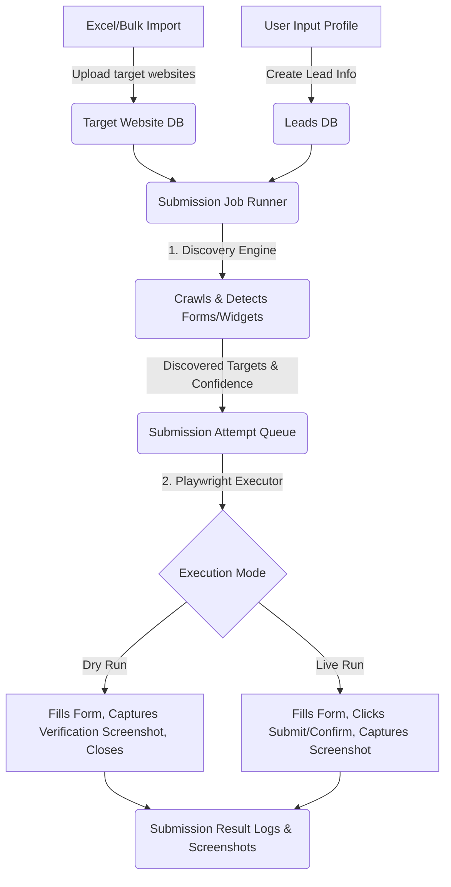

# Product Requirement Document (PRD)

## Project: SDI Lead Auto Submitter
**Document Version:** 1.0.0  
**Date:** July 14, 2026  
**Status:** Approved / Core Implemented  
**Target Platform:** Next.js (Local-First Web App) / Playwright (Browser Automation)

---

## 1. Executive Summary & Overview
The **SDI Lead Auto Submitter** is a local-first web application designed to optimize and automate cold outbound outreach. Instead of manually filling contact forms or booking call slots on target websites, the system parses prospective target URLs, automatically discovers their contact mechanisms (such as standard contact forms, Calendly pages, or HubSpot meeting schedulers), maps user-provided lead metadata to appropriate fields, and processes form execution automatically.

The system is built to run cleanly on a single local computer (using SQLite and local background job queue processes) or scale to a distributed production architecture (utilizing BullMQ + Redis for task distribution across multiple runner processes, with optional AWS S3 screenshot storage).

---

## 2. Product Goals & Objectives
*   **Automate Outbound Outreach:** Eliminate manual entry for outbound sales development representatives (SDRs) by automatically submitting lead details to contact options.
*   **Support Multi-Target Mechanisms:** Intelligently discover and submit to Contact Forms, HubSpot Calendar widgets, Calendly calendars, and Generic Booking Widgets.
*   **Optimize Discovery Confidence:** Crawl target websites heuristically, scoring potential forms and schedulers based on keywords, class tags, and iframe patterns.
*   **Reliable and Verifiable Results:** Provide visual verification via multi-step browser screenshots, execution attempts, and detailed log tracking for every outreach attempt.
*   **Flexible Execution Modes:** 
    *   *Dry-Run:* Complete forms without final submission/booking (to verify success paths safely).
    *   *Live Run:* Complete and submit forms for live lead generation.

---

## 3. System Architecture & Workflows

### 3.1 High-Level Data Flow



### 3.2 Target Discovery Workflow
1.  **Home Page Crawl:** Playwright navigates to the base URL.
2.  **Navigation Links Extraction:** Locates contact and booking page links based on header, nav, footer, and menu selectors matching keywords (e.g., `/contact`, `/book`, `/schedule`, `/quote`).
3.  **Blacklist/Filtering:** Skips pages matching privacy policies, terms, blogs, articles, and common media extensions (`.pdf`, `.png`, etc.).
4.  **Structural Target Scan:**
    *   Scans page structure for direct `<form>` elements and counts input matches.
    *   Searches for embedded iframes originating from `calendly.com`, `hubspot.com`, or match generic scheduler keywords.
5.  **Score & Confidence Assignment:** Assigns a confidence score ($0-100\%$) and establishes the execution hierarchy.

---

## 4. Key Functional Features & Requirements

### 4.1 User Authentication & Profile Management
*   **Requirement:** Multi-user framework protecting access to target lists, leads, and API settings.
*   **Details:** Passwords must be hashed and stored in database. Standard session handling controls access to client dashboards.

### 4.2 Lead Management
*   **Requirement:** Standardized customer outreach personas.
*   **Field Mapping:**
    *   Full Name
    *   Mobile/Phone Number
    *   Email Address
    *   Physical Address / Location
    *   Outreach Message
    *   Company Name

### 4.3 Target Website Import & Bulk Uploads
*   **Requirement:** Support xlsx/csv bulk sheet uploads containing columns for target domain URLs.
*   **Validation Rules:**
    *   Automatically formats URLs (adds `https://` if missing, normalizes hosts to lowercase, strips trailing slashes).
    *   Skips duplicates already present in the user's workspace.
    *   Optionally accepts pre-defined `contactPageUrl` or custom `notes`.

### 4.4 Target Discovery Engine
*   **Requirement:** Identify contact options on target URLs.
*   **Supported Targets:**
    | Target Type | Discovery Markers | Automation Support |
    | :--- | :--- | :--- |
    | **Contact Form** | Standard HTML forms, fields containing name/email/phone keywords | Yes (Playwright input mapping) |
    | **Calendly Widget** | Links or iframes matching `calendly.com/*` | Yes (time-slot search and form filling) |
    | **HubSpot Scheduler**| Embedded HubSpot scheduling pages / forms | Yes (form selection and submission) |
    | **Generic Widget** | Custom booking apps or third-party schedulers | Yes (limited heuristic locator matching) |

### 4.5 Automation Executor (Playwright)
*   **Requirement:** Interact with dynamic single-page apps (SPAs) and form components.
*   **Functionality:**
    *   Match fields by semantic proximity (keyword matching in labels, placeholders, input names, IDs).
    *   Support for multiple stages: Select appointment date $\rightarrow$ Choose time slot $\rightarrow$ Complete details form $\rightarrow$ Submit.
    *   Take action screenshots of the browser before submission, during form completion, and immediately after clicking submit.
    *   Store step-level logs for debugging.

### 4.6 Job Processing Queue
*   **Requirement:** Executing automation tasks asynchronously to prevent web server request timeouts.
*   **Architecture Options:**
    *   **Local Mode:** SQLite-backed polling mechanism. Low memory footprints, ideal for local execution and quick demos.
    *   **Enterprise Redis Mode:** BullMQ queue processor supporting multiple concurrent worker instances, rate-limiting, and configurable retry attempts.

---

## 5. Domain Database Schema (Prisma representation)
The database structure supports hierarchical tracking of execution pipelines:

| Model | Description | Key Relationships |
| :--- | :--- | :--- |
| **User** | System account containing profiles and credentials. | Has many `Lead`, `TargetWebsite`, `SubmissionJob` |
| **Lead** | Outbound message and sender metadata. | Has many `SubmissionResult` |
| **TargetWebsite** | Targeted site URL, status, and notes. | Has many `DiscoveredSubmissionTarget` |
| **SubmissionJob** | Job header tracking status (Pending/Completed). | Belongs to `Lead` & `User`, has many `SubmissionResult` |
| **SubmissionResult** | Tracks the submission outcome for a specific lead on a website. | Belongs to `SubmissionJob`, has many `SubmissionAttempt` |
| **DiscoveredSubmissionTarget** | Form / widget endpoint URL identified by the discovery engine. | Belongs to `TargetWebsite` |
| **SubmissionAttempt** | Playwright transaction execution details for a discovery target. | Has screenshots, status logs (`SubmissionAttemptLog`) |

---

## 6. Non-Functional & Operational Requirements

### 6.1 Performance and Resource Allocation
*   **Concurrency Settings:** The queue concurrency must be configurable. High concurrency (more than 3 simultaneous Chrome/Playwright instances) requires adequate host CPU/RAM resources.
*   **Timeouts:** Page navigations must time out after 45 seconds to prevent hanging browsers.

### 6.2 Visual Debugging and Traceability
*   **Screenshots:** Screenshots captured during run sequences are stored under the `/public/screenshots` directory (or S3 if using the S3 storage provider).
*   **Attempt Logging:** Step-by-step logs from the playwright worker are streamed to the database, allowing SDRs to inspect errors (e.g. "could not click select element", "CAPTCHA encountered").

### 6.3 Compliance and Ethical Usage
*   **Live Submission Safety:** The system operates in "Dry Run" by default to prevent spamming websites. Users must opt-in to active outbound submissions.
*   **Rate Limiting:** Users must observe rate limits to avoid overwhelming target server resources.

---

## 7. Product Roadmap & Future Phases

```
┌─────────────────────────────────┐
│ Phase 1: Core Automation (MVP)  │ ──> Local execution, basic form and widget completion
└─────────────────────────────────┘
                 │
                 ▼
┌─────────────────────────────────┐
│ Phase 2: Scale & Hosting        │ ──> Redis / BullMQ workers, S3 screenshot storage
└─────────────────────────────────┘
                 │
                 ▼
┌─────────────────────────────────┐
│ Phase 3: Stealth & Proxies      │ ──> Rotating proxies, user-agent spoofing, anti-bot bypass
└─────────────────────────────────┘
                 │
                 ▼
┌─────────────────────────────────┐
│ Phase 4: AI Field Mapping       │ ──> LLM-based form element detection for complex structures
└─────────────────────────────────┘
```
